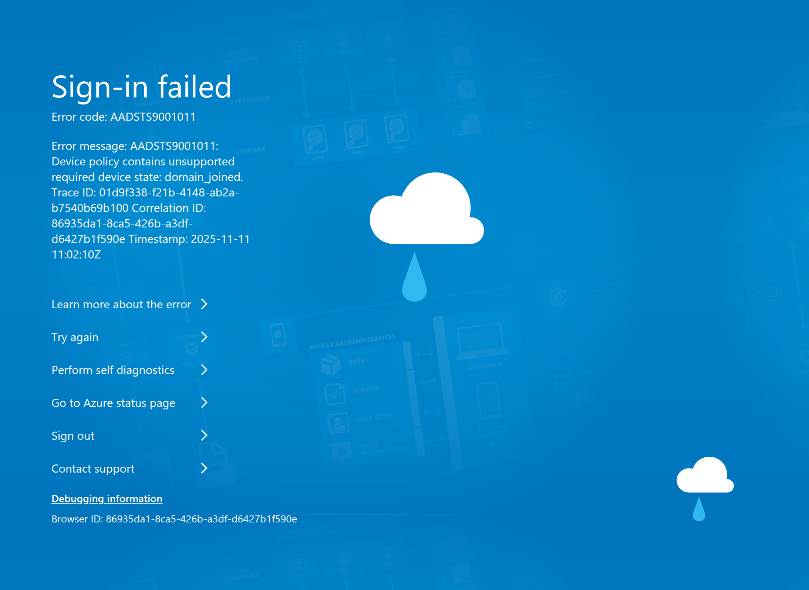

# Learning by Failing

## A Conditional Access horror story and what I learned from it

### Intro

This blog talks about what i did wrong when i went to set up Conditional Access in my microsoft tenant and what i learned from it. Additionally it is based on a talk i had recently at MVP-Dagen Roadshow Bergen. The presentation is available at my github. Hopefully this can help someone setting up Conditional Access avoid the pitfalls i fell into.

### Background

I was getting into homelabbing a while back, and since I work mostly with Microsoft services in the cloud, I thought getting a Microsoft tenant would be smart so I could test things and get even more familiar with the services I use day to day. Additionally, I wanted to use Microsoft’s services for mail, Outlook. The thing was that I had not yet learned about something crucial to any Conditional Access implementation, namely the Break Glass Account. The Break Glass Account functions as the emergency key to the environment when you are locked out. For example by conditional access which, is the system that decides who and how people or systems can log into your Microsoft tenant, Is setup wrong...

### What happened?

While setting up Conditional Access, I had issues with getting my policies to report that they had indeed blocked or allowed any logins. I was skimming through my sign-in logs but could not see anything that applied to my account. Until this point, I had only managed existing Conditional Access environments and not set one up myself. I tweaked the policies I had and used Microsoft’s own templates, but nothing seemed to work. I started to think that the issue lay in faulty reporting when the policies were set to Report-only, so I set all my policies to the state “on.” After that didn’t work, I tinkered around a bit more before I saw the exclude tab. Thinking I finally found the culprit, I removed the exclusion of my account on all the policies and then refreshed my browser...

Here is a recreation of the error I got:  

### Consequences

As you can see, I had locked myself out of my tenant properly. Specifically, I had required that I log on from a domain or hybrid-joined device in my cloud-only environment. Effectively, I could not use any of my Microsoft services related to Entra ID. At the time, this was mostly affecting my management of Entra ID, Intune, and Azure as well as OneDrive and Outlook.

I am glad I was in a small tenant with just myself. If this had happened in a production environment or in an organization that relies on Entra ID to authenticate to more business-critical services, then this would be a disaster. My policies were scoped to all users and services, so everything that was integrated with Entra would be impacted and locked.

#### Some questions to consider
- Can you do business if you are locked out of your authentication platform?
- Is Single Sign-On (SSO) worth it if it can be this big of a single point of failure?

### Solution

My solution started with DNS. These days that is usually not how it goes, seeing both AWS and Azure struggling just a couple of weeks ago. Through DNS, I could point back to my domain registrar’s own E-Mail solution so I could communicate on my E-Mail. Then I called up my old friend Microsoft, as I could not open a ticket in the intended way. What met me on the phone was the answer: “You are not an Administrator, you need to contact your Administrator about this issue.” You see, what had happened was that I had configured Privileged Identity Management, and my account did not have the permanent assignment as Global Administrator. This made Microsoft’s support unsure of who I was, as I looked like just another user. After a lot of back and forth, they finally understood what I had done, and they then requested I add a DNS TXT record with a specific string so they could verify that I owned the domain that was connected to my tenant. After doing so, they elevated my account to a Global Administrator and gave me 24 hours to fix my stuff.

In short, having my DNS services outside of the Microsoft sphere of influence ensured I could communicate with Microsoft efficiently and get back into my tenant through DNS ownership verification.

The time to solve my issue was about 4 weeks, as I did not have any fancy support deals with Microsoft. There was a lot of back and forth, and due to me using Privileged Identity Management and not being an admin, I had to do extra verification steps. I also missed some calls due to getting them while at work or working with other things. I have seen this happen to a company, they got it solved in 2.5 days, as the only focus for them was getting their environment up and going again since they were losing money every day.

### What did I learn?

#### Exclusions

The most important thing I learned was that you must always have the correct exclusion in your Conditional Access policies, this being your Break Glass Account(s). Thankfully, since my mishap, Microsoft took to agreeing with that, and it is now not possible to set up a Conditional Access policy without an exclusion. But stay vigilant — you can still add an empty group for an exclusion, so make sure to either lock the groups with Restricted Administrative Units so no one can tamper with them or monitor them with the Conditional Access Optimization Agent. (Thank you to Julian Rasmussen for demoing this right after my talk!)

#### Testing

I should have tested things more thoroughly, but because it was my environment that only served me, I got sloppy. What I will do going forward is have a couple of test users, one “normal” and one “admin,” that I can test and emulate what I do in a day, then analyze the results from the report-only overview. This ensures I can understand what the policies do before I implement them, as well as not locking myself out completely while testing.

#### Break Glass Account

Here I will preface that you should consult the documentation of your identity provider, as a Break Glass Account (BTG) is really important to set up correctly. Here is a link to the docs for [Entra ID](https://learn.microsoft.com/en-us/entra/identity/role-based-access-control/security-emergency-access). Here you can also find resources on how to look after its credentials. The TL;DR is: use a FIDO2 key for MFA and store the password and FIDO2 key in separate safes in different locations.

BTG accounts are emergency access accounts that are supposed to be used for situations where one would need to be an administrator but does not have access through “normal” means, for example, if you are locked out of your tenant due to Conditional Access, or you have an emergency and the normal means to acquire the Global Administrator role is through approval, and due to the emergency, the party responsible for approving is not able to do so. Then you would be able to access the BTG account and make the changes needed.

I thought Privileged Identity Management (PIM) was a smart thing to always use. I was not entirely wrong, but in my situation with no BTG account, it created more hassle, as Microsoft could not see that I had any admin accounts at all because of me implementing PIM and my admin account having just-in-time (JIT) access to their admin roles. Had I set up a BTG account, I would have been able to give them a quick answer instead of trying to explain PIM to the support tech so they could understand that yes, I’m an admin — just not right now...

#### Not using templates or solutions you do not fully understand

This is the age-old rule: “If you find a script online, do not just run it. Read it until you understand it. Then you may use it if it does what you want it to.” I added all the “cool” policies to my setup without seeing if I needed them. For my cloud-only setup, I did not need a policy that locked out all devices that were not AD joined...

#### DNS

If I had moved my domain completely to being managed by Microsoft, I would not have been able to edit the TXT record to prove I owned it. I will be keeping my domains with a third party because of this.

#### Is SSO bad because it’s a huge single point of failure?

Short answer: No.  
Longer answer: The control and visibility you get from having one authentication platform is still not understood enough, in my opinion. Too often I see organizations that have their office apps and e-mail in one place and then register to a third-party app with their work mail. This is effectively shadow IT and makes you lose control of your attack surface. You no longer get to enforce your password, MFA, and Conditional Access policies. The user also has to remember another password; if you have enough services like this, there will be a compromise to password strength as users have to remember more passwords, and they tend to use the same or weaker passwords.

#### Documentation

I found documenting Conditional Access to be a bit of a drag. Wanting to automate it, I found Merill Fernando’s IDPowerApp Conditional Access Documenter, it is a tool that does a good job of documenting your policies: [IDPowerApp](https://idpowertoys.merill.net)

### Thank you

As i said earlier, this blog is based on a presentation i had previously. It was my first talk "on my own" so that was exciting and it is something i hope to do more of. Additionally i hope this blog could serve as a reminder to stay alert while configuring the more mundane tasks. 
