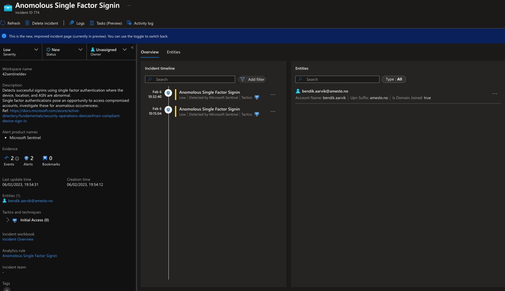
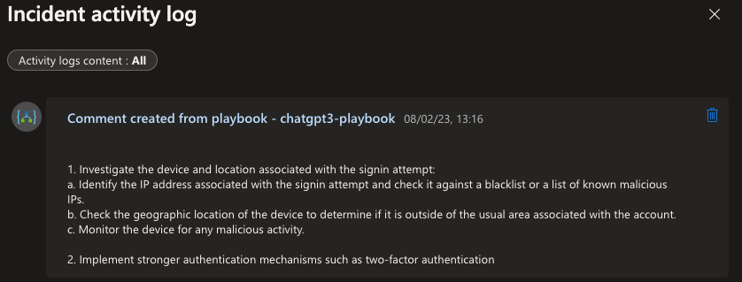

## Sentinel and ChatGPT

My latest obsession, like many others, has been ChatGPT. Everything from making detailed backstories to fictional characters to brainstorming how to finish a sentence. Here my intentions are to go through some of my findings regarding using ChatGPT to help me with my work. Specifically incident investigation in Sentinel.

## **Using ChatGPT for Incident Triage in Azure Sentinel**

One of the key tasks in incident management is triaging incidents to determine their severity, priority, and next steps for resolution. ChatGPT can be a valuable tool in this process, providing relevant information and guidance based on the incident name and description. By using natural language processing, ChatGPT can quickly understand the context of an incident and provide insights that can help accelerate the triage and investigation process.

## **ChatGPT in Action**

Here's an example scenario to illustrate how ChatGPT can assist with incident triage in Azure Sentinel:

Here a Azure Sentinel alert is triggered for an anomolous single factor login. The incident is named "anomolous single factor login" and the description goes further into what the analytics rule investigates and where to start investigating deeper. Then you have some enteties like device, user and IP. 

By asking ChatGPT through a Logic App, we can give an analyst some quick start steps so the analyst quickly can determine the severity of the threat and take appropriate action. An example of a comment like this can be seen here: 

This is achieved by integrating the ChatGPT API into a simple Logic App. Here we ask for concrete steps to do incident management based on diffrent fields like the title, description, and entities available through Sentinel's integration with the Logic App."

My app looks like this:

## **Advantages of Using ChatGPT for Incident Management in Azure Sentinel**

Using ChatGPT for incident management in Sentinel offers several advantages, including:

- Triage and starting the investigation
    - The most value we have seen is ease of triage and starting the investigation. This is so the analyst quickly can get a good overview of the incident then take good decisions on how to handle the incident
- Faster resolution times: 
    - The more efficient start of incident handling with ChatGPT can provide good information so the resolution of incidents go faster and often with greater confidence.
- Improved efficiency:
    -  Having analyst spend less time on consolidating information when ChatGPT can summarize it quickly improves efficiency more than one would think. Furthermore we can use ChatGPT to automate other parts of the incident management process, freeing up more analysts time to focus on more complex tasks.
- Reduced risk:
    - ChatGPT can help reduce the risk of human error in incident management, ensuring that the relevant actions are taken and option paralasis is avoided.

## **Conclusion**

In conclusion, ChatGPT can be a valuable tool for incident triage and investigation in Sentinel it does not do the job for you but eases it by alot. 

**BUT**, (there always seem to be one with AI) Lets talk about data protection. All of this testing was done in a development environment with less important data.". I would not shove this into production today because incident management often handles very sensitive data that has no business floating around. As i personally do not trust the API connection enough. All the concerns and discussions ive read so far. Have all had an echo of you should not feed it sensitive data although ChatGPT no longer "learns"

Here is what ChatGPT said it self about feeding it sensitive info:

Me: 

"What are concerns around feeding you or other AI models like you with sensitive info?"

ChatGPT: 

"There are several concerns around feeding AI models with sensitive information, including:
- Data privacy: Sensitive information, such as personal information or confidential business data, may be at risk of being leaked or used for malicious purposes.
- Bias: AI models may perpetuate and amplify existing biases in the data they are trained on, leading to unfair or inaccurate predictions and decisions.
- Responsibility: It may be unclear who is responsible for the consequences of decisions made by AI models, especially if they result in harm.
- Security: AI models can be vulnerable to cyber attacks, which could result in the theft or manipulation of sensitive information.
- Regulation: There may be limited regulations in place to govern the collection, storage, and use of sensitive information by AI models, leaving room for abuse.
- Explainability: AI models can be seen as "black boxes", meaning that their decision-making processes can be difficult to understand or interpret, making it challenging to ensure they are making ethical decisions.

It is important to consider these concerns and implement measures to mitigate them when using AI models, such as data privacy policies, bias mitigation techniques, and transparent and explainable AI."

